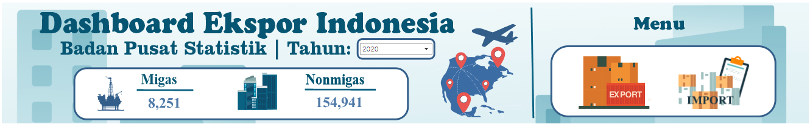
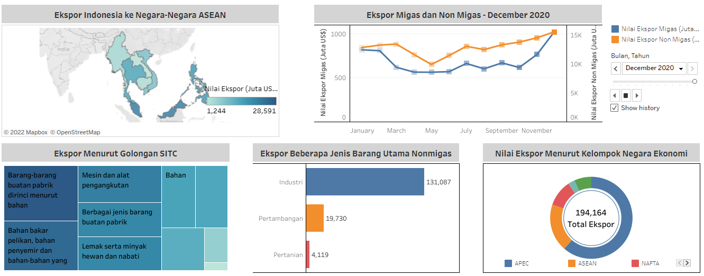

<!--
*** Thanks for checking out the Best-README-Template. If you have a suggestion
*** that would make this better, please fork the repo and create a pull request
*** or simply open an issue with the tag "enhancement".
*** Don't forget to give the project a star!
*** Thanks again! Now go create something AMAZING! :D
-->

<!-- PROJECT SHIELDS -->
<!--
*** I'm using markdown "reference style" links for readability.
*** Reference links are enclosed in brackets [ ] instead of parentheses ( ).
*** See the bottom of this document for the declaration of the reference variables
*** for contributors-url, forks-url, etc. This is an optional, concise syntax you may use.
*** https://www.markdownguide.org/basic-syntax/#reference-style-links
-->

<!-- PROJECT LOGO -->
 

  

  <h2 align="center">Sektor Perdagangan Luar Negeri Indonesia</h2>

 

<!-- ABOUT THE PROJECT -->
# Implementasi Dashboard Interaktif untuk Data Ekspor-Impor Indonesia

Semakin meluasnya dampak dari globalisasi dan meningkatnya perkembangan teknologi, membuat ketergantungan antar negara semakin tinggi. Indonesia sebagai negara yang menganut sistem perekonomian terbuka membuat transaksi jual-beli antar negara menjadi semakin mudah. Kegiatan jual beli antar negara tersebut dinamakan ekspor-impor. Kegiatan ekpor-impor dapat terjadi karena ketidakmampuan suatu negara dalam memenuhi kebutuhannya. Data mengenai ekspor-impor disajikan secara periodik setiap tahunnya oleh BPS (Badan Pusat Statistik) dalam lingkup nasional. Penyajian data ekpor-impor pada laman resmi bps.go.id dapat dilihat melalui berbagai tabel dinamis dan dalam bentuk publikasi. Penyajian data dalam bentuk tabel dinamis dan publikasi yang ada dirasa masih kurang informatif karena masih disajikan secara statis tiap tahunnya. Oleh karena itu, dibutuhkan visualisasi data yang efektif supaya dapat memberikan kenyamanan kepada para pengguna data dalam memahami hubungan antar data serta dapat membantu dalam pengambilan keputusan secara tepat. 
 

## Sumber Data

Data yang digunakan dalam penelitian ini adalah data ekspor-impor yang berasal dari tabel dinamis dan beberapa publikasi yang diterbitkan <a href="https://www.bps.go.id/">BPS RI</a> yaitu Statistik Perdagangan Luar Negeri Indonesia Ekspor/Impor Tahun 2015-2020. Data yang digunakan diantaranya

* Data ekspor Indonesia ke negara-negara ASEAN
* Data ekspor migas – non migas 
* Data ekspor menurut golongan SITC
* Data ekspor beberapa jenis barang utama nonmigas
* Data nilai ekspor menurut kelompok negara ekonomi 
* Data perdagangan luar negeri Indonesia dengan mitra dagang utama
* Data impor migas – non migas
* Data impor menurut golongan SITC
* Data nilai impor menurut negara kelompok ekonomi
* Data impor menurut golongan pengguna
    

<!-- GETTING STARTED -->
## Tahap Perancangan

### Pengumpulan Data

Penelitian ini menggunakan data tabel dinamis dan beberapa publikasi yang diterbitkan <a href="https://www.bps.go.id/">BPS RI</a> mengenai ekspor-impor yaitu Statistik Perdagangan Luar Negeri Indonesia Ekspor/Impor Tahun 2015-2020.
  

### Seleksi Data
Dari berbagai macam sumber data yang diperoleh, selanjutnya akan dilakukan seleksi data untuk dapat memberikan gambaran suatu fenomena yang terjadi dengan memilih data yang penting dan lengkap yang kemudian akan dilakukan tahap visualisasi lebih lanjut. Semua data yang disajikan dalam visualisasi ini memiliki satuan Juta US$.
  

### Visualisasi Data
Data yang telah disiapkan kemudian dilakukan tahap visualisasi menggunakan tableau dengan menggunakan beberapa jenis visualisasi yaitu:

1. Visualisasi Peta

    Data mengenai ekspor Indonesia ke negara-negara ASEAN dan data perdagangan luar negeri Indonesia dengan mitra dagang utama disajikan dalam bentuk peta. Visualisasi ini dipilih karena dirasa dapat membantu pengguna dalam mengetahui persebaran ekspor dan impor Indonesia ke dan dari beberapa negara tetangga. 

2. Diagram Garis
   
   Data mengenai ekspor-impor migas-non migas disajikan dalam bentuk diagram garis. Data mengenai ekspor-impor migas-non migas tersedia dalam bentuk time series setiap bulan sehingga penggunaan diagram garis dirasa cocok untuk menggambarkan _trend_ dari perkembangan nilai ekpor-impor migas-non migas perbulan atau bahkan dari tahun 2015-2020. 

3. _Treemap_

    Data mengenai ekspor-impor menurut golongan SITC disajikan dalam bentuk _treemap_. Penggunaan visualisasi _treemap_ ini dipilih karena dirasa akan lebih mudah ketika dipahami oleh pengguna.

4. Diagram Batang

    Data mengenai ekspor beberapa jenis barang utama non migas dan data impor menurut negara kelompok ekonomi disajikan dalam bentuk diagram batang. Pemilihan diagram batang untuk visualisasi ini bertujuan untuk memudahkan pengguna dalam melihat perbedaan dari masing masing sektor ekspor beberapa jenis barang utama non migas serta perbedaan impor berdasarkan negara kelompok ekonomi.

5. _Donut Chart_

    Data mengenai ekspor menurut negara kelompok ekonomi dan data impor menurut golongan pengguna disajikan dalam bentuk _donut chart_. Pemilihan visualisasi ini ditujukan supaya pengguna dapat dengan mudah memahami informasi yang akan disampaikan dan dikarenakan visualisasi denga menggunakan  _donut chart_ dirasa lebih baik daripada dengan _pie chart_.  

 

<!-- USAGE EXAMPLES -->
## Pembuatan Dashboard
Setelah semua data telah divisualisasikan, selanjutnya adalah tahap menyatukan semua visualisasi ke dalam dashboard. Terdapat 2 bagian utama dalam dashboard yang telah dibuat, yaitu:

* _Header_

    Dalam bagian ini terdapat judul dashboard, _highlight_ informasi mengenai nilai ekspor atau impor migas dan non migas, serta menu untuk berpindah dashboard

    

     

* Visualisasi 

    Dalam bagian ini terdapat seluruh hasil visualisasi data yang telah dibuat berdasarkan data yang ada.

    

     
  

Sedangkan untuk tampilan dashboard yang lengkap dapat dilihat pada gambar berikut.
* Dasboard Ekspor
  
    

     
  

* Dasboard Impor
  
    

     
   

Untuk detail dashboard secara online dapat diakses pada <a href="https://public.tableau.com/app/profile/dita.dwi5511/viz/UASVisdat_16554622919460/Dashboard2">Dashboard Visualisasi</a>
